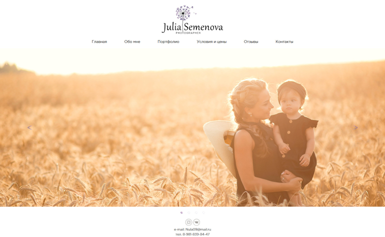
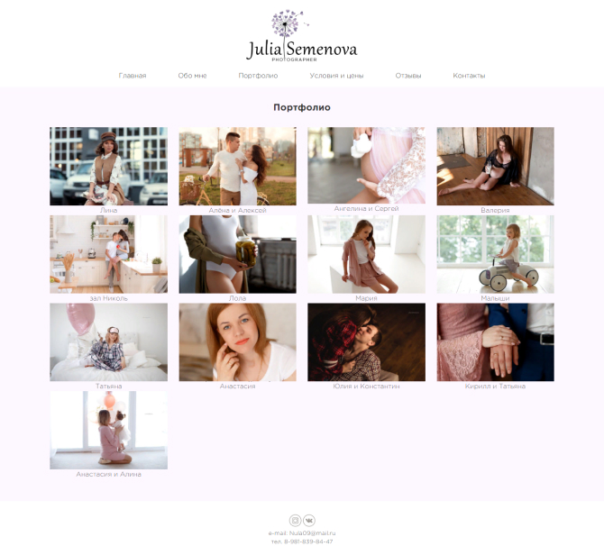
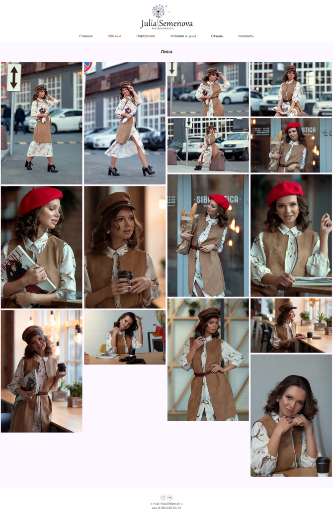
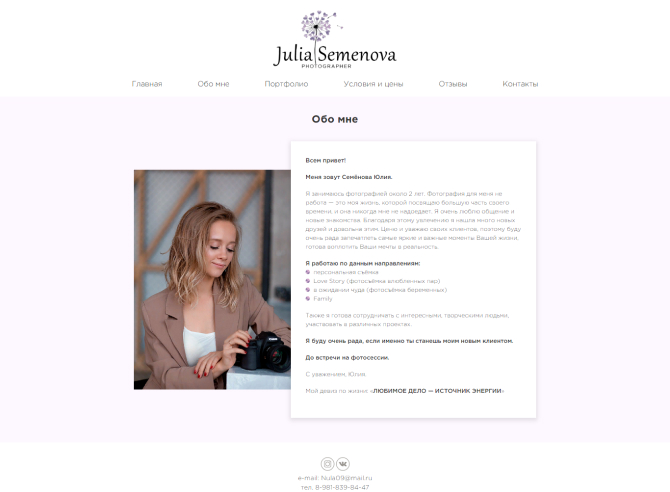
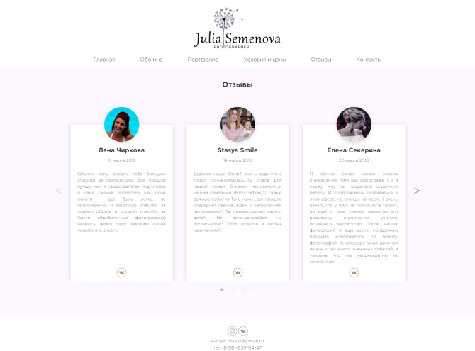

# Website development for the photographer

##Project discussions with the customer
First of all, when developing a new project, you need to discuss the goals with the client in order to understand what problem we are solving with the help of the site. The development of goals immediately makes it clear what the client needs and what optimal tools to use when developing. The best option is when the customer himself already has a ready-made technical task for the site, which describes all the requirements for the project, from semantic to technical. When the client has such a document on hand, then we can easily understand whether it is possible to make such a project, and also immediately calculate the cost and deadlines.

Julia did not have such a document and we discussed the project in person. Julia is a photographer and she needed a site to post her work on it. It was necessary not only to make a functional and beautiful site, but also to teach Julia to use this site without going into details about how everything works. Julia had such a situation that her clients asked her for a site where she could see her work, but she had nothing to answer. When the work is posted on its own site it gives confidence in the person and increases solidity. Julia also needed a logo that would combine in one style all the design of her activities.

Logo design as part of the site
The first step was to make a logo. The development of the logo and the entire design was undertaken by Svetlana. Julia is a family photographer, and for her she is actively associated with lightness, tenderness and beauty. There was a desire to do something related to dandelion. In the photo below you can see the result of the logo development.

In reality, there were several options with different colors and layouts of elements. Julia liked this result and we left it.

## Prototyping site pages

In developing the pages of the site, we have steadily thought about the goals of the site, and implemented them. When you get to the main page, it should immediately be clear that we are on the photographer’s website. A site visitor should immediately see the professionalism of the photographer and his work, so there are a minimum of elements on the main page. The main thing is that on the first screen there is a huge slider, on the whole page, in which 4 works of the photographer revolve in a circle. This is a very cool effect when you get to the site. Above the navigation menu and below a small footer.

I will not describe all the pages of the site in detail, I will talk about the album page. The main rule that we took during the development of the layout is that it is necessary to have a maximum of photos on the screen. In the album you can see that the photo is full screen, which looks very cool. If you click on any photo, it opens in full screen, it is possible to see all photos in order.

##Site design

The whole site design works with only one idea, emphasize the photographs of Julia. This project has a minimalistic design. An elegant font emphasizes the subtlety to detail, and calm tones do not distract from the content of the site.

## Layout and programming

When developing the site, it was decided to use CMS WordPress. For this project, design was made from scratch. The WordPress platform itself has developed a system for posting photos to the site, convenient administration and editing of existing albums.

## Results

In the end, we got a modern and functional site. In it, we realized all the wishes of the client, starting with the logo, ending with fast loading and full functioning of the resource